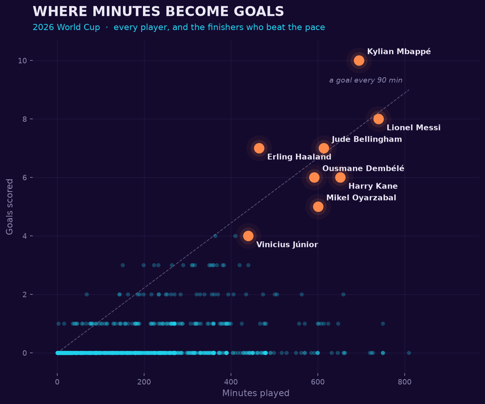
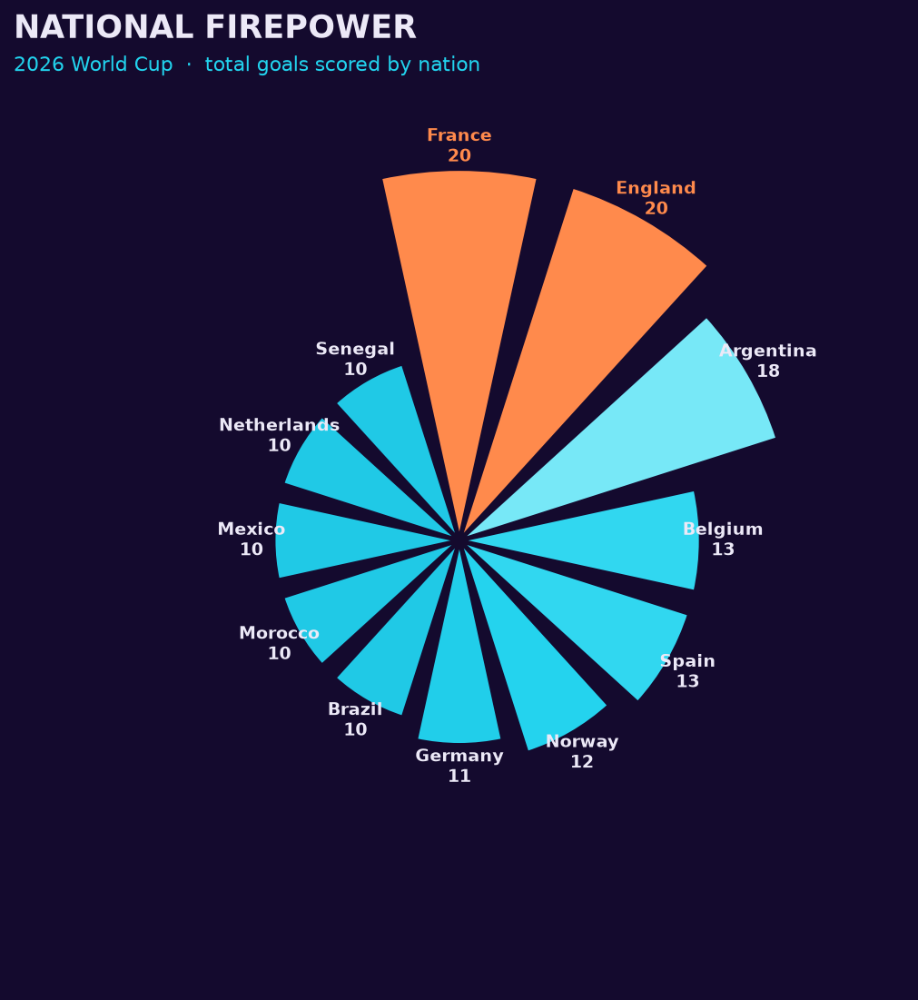

# viz_lib ⚽

A tiny, aesthetic Python library for visualizing **2026 World Cup player
statistics** with matplotlib. It's a minimal viable product: one package, two
bare-bones chart functions, and a single editorial "midnight pitch" look — a
deep indigo background with a complementary **teal + coral** palette. No
dashboards, no web app. Point it at the season's CSV and get a poster-quality
chart.

The whole library is **under 200 lines** ([`src/viz_lib/core.py`](src/viz_lib/core.py)).

## Install

From a local checkout:

```bash
pip install -e .
```

## The dataset

Player-level stats for the **2026 men's World Cup** — goals, assists, minutes,
position, nation, and more — in
[`examples/data/wcplayerstatistics2026.csv`](examples/data). Each row is one
player.

## Quickstart

```python
import matplotlib.pyplot as plt
import viz_lib

# load() cleans the "fr France" squad codes into a tidy Country column
df = viz_lib.load("examples/data/wcplayerstatistics2026.csv")

viz_lib.minutes_vs_goals(df)     # who turned minutes into goals
viz_lib.nation_firepower(df)     # goals by nation, as a radial chart
plt.show()

# every chart accepts save_path= to write a PNG straight to disk
viz_lib.minutes_vs_goals(df, save_path="minutes_vs_goals.png")
```

Or just run the bundled example, which builds both charts from the data folder:

```bash
python examples/worldcup_analysis.py
```

## The visualizations

### 🎯 Where Minutes Become Goals — `minutes_vs_goals(df, highlight=8)`

Every player plotted as **minutes played (x) vs goals scored (y)**. The whole
tournament forms a faint teal field of dots; the top finishers glow coral and
are named. A dashed guide marks the elite *"a goal every 90 minutes"* pace —
players above it are outscoring the clock.



### 🔥 National Firepower — `nation_firepower(df, n=12)`

A radial bar chart of total goals per nation. Bars run a light-to-deep teal
ramp by goals, and the leading nation(s) blaze coral so the eye lands on them
first.



## API

| Function | What it does |
| --- | --- |
| `load(path)` | Read a stats CSV into a tidy DataFrame with a clean `Country` column |
| `minutes_vs_goals(df, highlight=8)` | Minutes-vs-goals scatter; top `highlight` scorers glow and are named |
| `nation_firepower(df, n=12)` | Radial bar chart of goals by the top `n` nations |

Both chart functions return a matplotlib `Axes` (so you can keep tweaking) and
accept `save_path=` to write the figure to disk.

## Design notes

- **Complementary palette.** Teal (`#22d3ee`) and coral (`#ff8a4c`) sit opposite
  each other on the colour wheel, so they pop against the deep indigo
  background without clashing — and the pair stays distinguishable for
  colourblind readers.
- **Colour has one job per chart.** Teal always carries the data; coral is
  reserved for the standout — the top finishers, the leading nations.
- **Neon glow, honestly.** The bloom on highlighted marks is drawn by stacking
  translucent copies, not faked with a second axis. Two variables on different
  scales (minutes vs goals) are shown as a scatter, never a dual-axis chart.

## Project layout

```
viz_lib/
├── pyproject.toml            # package metadata (build with setuptools)
├── src/viz_lib/
│   ├── __init__.py           # public API
│   └── core.py               # both charts + shared theme (< 200 lines)
└── examples/
    ├── worldcup_analysis.py  # runnable demo
    ├── data/                 # the 2026 World Cup CSV
    └── charts/               # generated PNGs (shown above)
```

## Requirements

Python 3.8+, plus `pandas`, `numpy`, and `matplotlib` (installed automatically).

## License

MIT — see [LICENSE](LICENSE).
