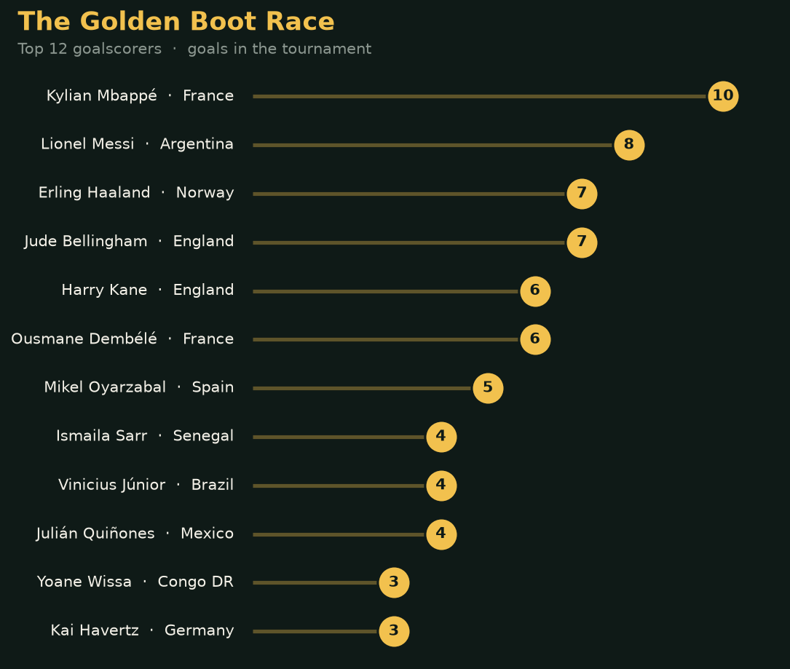
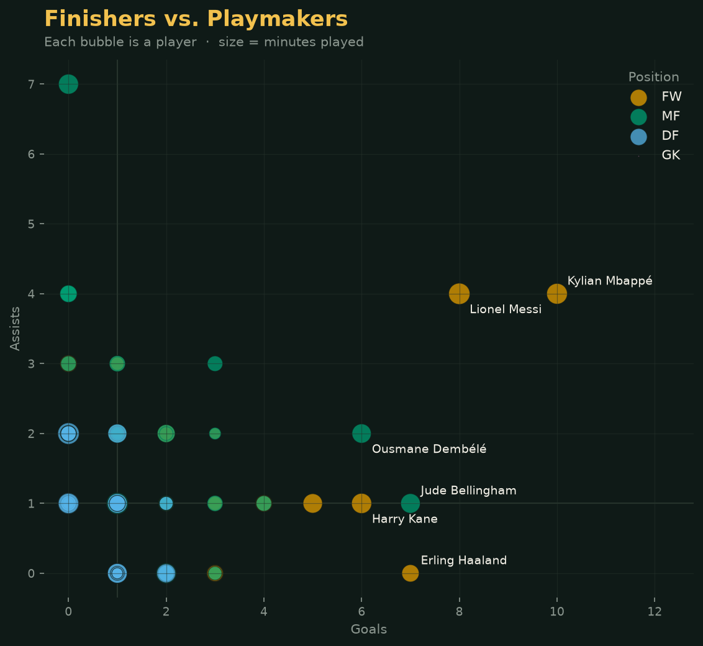
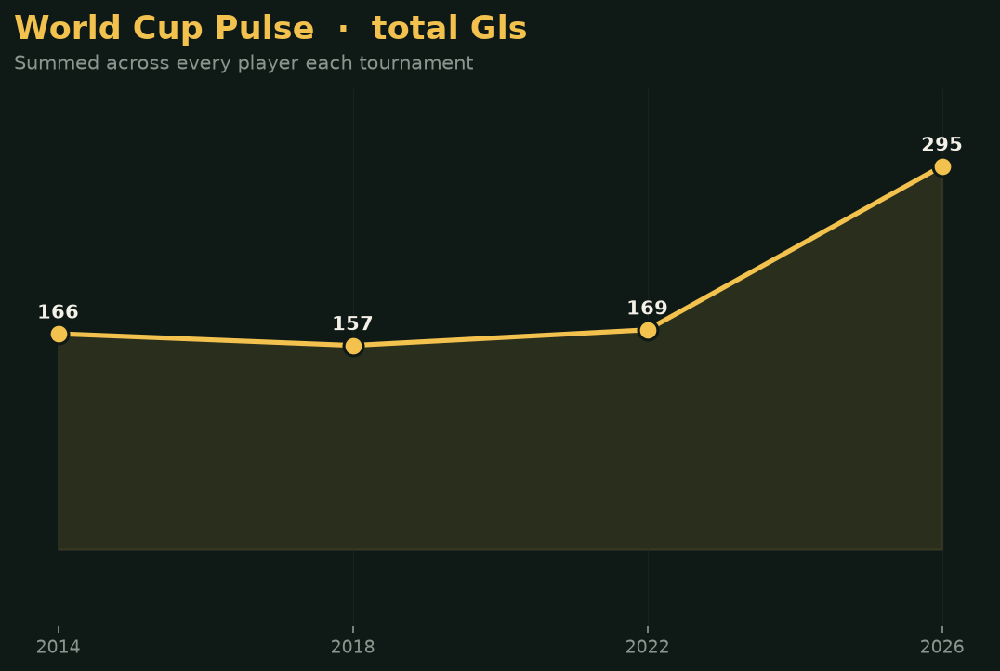

# viz_lib ⚽

A tiny, aesthetic Python library for visualizing **World Cup player statistics**
with matplotlib. It's a minimal viable product: one package, a handful of
bare-bones functions, one shared "stadium night" look, and no dashboards or web
apps to fight with. Point it at a season's CSV and get a poster-quality chart.

The whole library is **under 200 lines** ([`src/viz_lib/core.py`](src/viz_lib/core.py)).

## Install

From a local checkout:

```bash
pip install -e .
```

## The dataset

Player-level stats for the 2014, 2018, 2022, and 2026 men's World Cups —
goals, assists, minutes, position, nation, and more — in
[`examples/data/`](examples/data). Each row is one player in one tournament.

## Quickstart

```python
import matplotlib.pyplot as plt
import viz_lib

# load() cleans the "fr France" squad codes into a tidy Country column
df = viz_lib.load("examples/data/wcplayerstatistics2022.csv")

viz_lib.golden_boot(df)                 # top goalscorers
viz_lib.finishers_vs_playmakers(df)     # goals vs assists, sized by minutes
viz_lib.nation_firepower(df)            # goals by nation, as a radial chart
plt.show()

# every chart accepts save_path= to write a PNG straight to disk
viz_lib.golden_boot(df, save_path="golden_boot.png")
```

Or just run the bundled example, which builds all four charts from the data
folder:

```bash
python examples/worldcup_analysis.py          # latest tournament
python examples/worldcup_analysis.py 2018     # pick a year
```

## The visualizations

### 🥇 The Golden Boot Race — `golden_boot(df, n=12)`

A lollipop chart of the tournament's top scorers, each nation named. Clean,
ranked, and easy to read at a glance.



### 🎯 Finishers vs. Playmakers — `finishers_vs_playmakers(df, min_90s=1.5)`

Every attacking contributor plotted as **goals (x) vs assists (y)**, with bubble
size scaling to minutes played and colour marking position. Pure finishers sit
to the right, creators sit high, and the complete forwards land in the top-right
corner. Median lines split the pitch into quadrants.



### 🔥 National Firepower — `nation_firepower(df, n=12)`

A radial bar chart of total goals per nation. Bar length *and* colour both
encode goals (light → deep red), so the strongest attacking sides jump out.


### 📈 World Cup Pulse — `tournament_trend(by_year, stat="Gls")`

Feed it a `{year: DataFrame}` dict and it tracks any summed stat across
tournaments. (The 2026 jump reflects the expanded 48-team format — more teams,
more games, more goals.)



## API

| Function | What it does |
| --- | --- |
| `load(path)` | Read a stats CSV into a tidy DataFrame with a clean `Country` column |
| `golden_boot(df, n=12)` | Lollipop chart of the top `n` goalscorers |
| `finishers_vs_playmakers(df, min_90s=1.5, annotate=6)` | Goals vs assists scatter, sized by minutes, coloured by position |
| `nation_firepower(df, n=12)` | Radial bar chart of goals by nation |
| `tournament_trend(by_year, stat="Gls")` | Line chart of a summed stat across tournaments |

Every chart function returns a matplotlib `Axes` (so you can keep tweaking) and
accepts `save_path=` to write the figure to disk.

## Design notes

- **One shared look.** A dark "stadium night" theme with a gold accent lives at
  the top of `core.py`, so every chart is instantly part of the same family.
- **Colourblind-safe by construction.** Player positions use the
  [Okabe-Ito](https://jfly.uni-koeln.de/color/) palette, assigned in a fixed
  order — never a rainbow, never cycled.
- **Magnitude → one hue.** `nation_firepower` uses a single light→dark red ramp
  for goals rather than arbitrary colours.

## Project layout

```
viz_lib/
├── pyproject.toml            # package metadata (build with setuptools)
├── src/viz_lib/
│   ├── __init__.py           # public API
│   └── core.py               # all the plotting (< 200 lines)
└── examples/
    ├── worldcup_analysis.py  # runnable demo
    ├── data/                 # the World Cup CSVs
    └── charts/               # generated PNGs (shown above)
```

## Requirements

Python 3.8+, plus `pandas`, `numpy`, and `matplotlib` (installed automatically).

## License

MIT — see [LICENSE](LICENSE).
